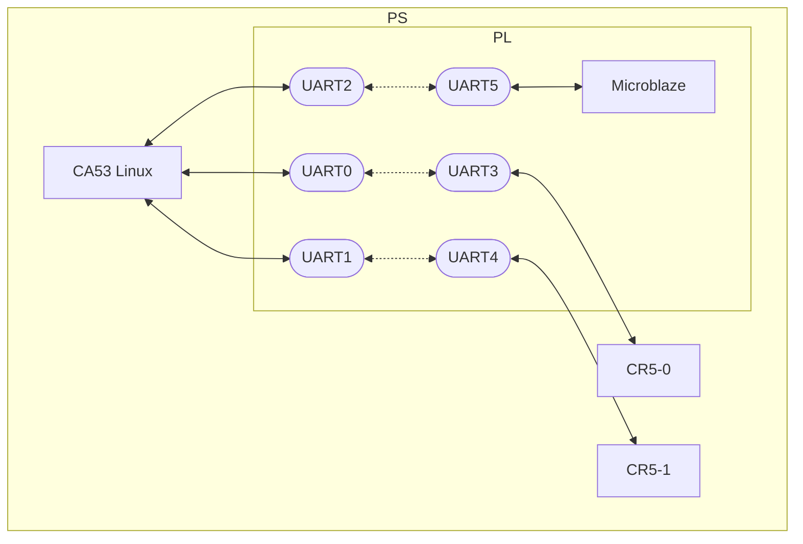

# UART-AMP for Kria(ZynqMP) 

[日本語版はこちら](https://github.com/kern-gt/ZynqMP-UART-AMP-KR260-Ubuntu/blob/main/README_jp.md)

## Overview
This is a demonstration of core-to-core communication between Linux and a sub-core on ZynqMP. The following configurations are supported.
* CA53 (AMD/Xilinx certified Ubuntu 22.04)
* Sub-core(0,1) : CR5-0, CR5-1 on PS
* Subcore(2) : Microblaze on PL
* CA53 (Linux) and sub-core on PL connected by AXI-UARTLite
* Echo-back test sample
* KR260 board

CA53 : ARM Cortex-A53  
CR5 : ARM Cortex-R5  
UART : Xilinx LogiCORE™ IP AXI UART Lite
  
## Getting Started
Pre-built firmware and Bitstream are available to try an immediate echo-back test.
See below for details.
[linux_uart_amp_echo_test/README.md](https://github.com/kern-gt/ZynqMP-UART-AMP-KR260-Ubuntu/blob/main/linux_uart_amp_echo_test/README.md)
  
## Advantages of UART-AMP
* UART API on Linux side is simple because of ordinary serial
* UART driver (AXI-UARTLite) on Linux side is mature.
* Sub-core API is simple because of FreeRTOS Stream Buffer for both transmit and receive.
* Mature UART driver on sub-core side
* AXI-UARTLite IP is mature
* CR5's Split mode enables communication on each of the two cores.
* Microblaze can also support multiple cores
* AXI-UARTLite IP can determine the baud rate before compiling, so there are no bugs caused by misconfiguration of communication speed on the software side.
* When debugging, direct observation is possible by changing the Bitsream so that the TX and RX lines of the UART are connected externally.
* Unlike the master-slave method, the sender can determine the timing of the UART.
* Devicetree Overlay code can be automatically generated by XSCT from Vivado export files

## Disadvantages of UART-AMP
* Communication speed is slow because of UART
* If there is a problem with the Clock generator, there is a risk of communication failure due to baud rate misalignment.
* Increased PL footprint cost to deploy AXI-UARTLite IP
* No communication at all if PL configuration fails

   
## Folder structure
### hw_export
For more information, please refer to the following
[hw_export/README.md](https://github.com/kern-gt/ZynqMP-UART-AMP-KR260-Ubuntu/blob/main/hw_export/README.md)

### jtag_tcl
Kria K26 SOM does not have a switch for Jtagboot, so you need to use the TCL command from XSCT to switch to Jtag debugging on the sub-core.
You can switch by running switch_jtagboot.sh.

### linux_uart_amp_echo_test
This contains the echo back test code to be executed on CA53 (Linux side). See below for details.  
[linux_uart_amp_echo_test/README.md](https://github.com/kern-gt/ZynqMP-UART-AMP-KR260-Ubuntu/blob/main/linux_uart_amp_echo_test/README.md)

### microblaze_firmware.vitis_classic
Contains projects for the subcore Microblaze development environment.
Vitis Classic v2024.1.1
Only Microblaze uses the Classic version because of debugging problems with the Vitis Unified IDE.  
[microblaze_firmware.vitis_classic/README.md](https://github.com/kern-gt/ZynqMP-UART-AMP-KR260-Ubuntu/blob/main/microblaze_firmware.vitis_classic/README.md)

### openamp_dts
CR5 firmware ELF is loaded, remoteproc is required to manage core startup and shutdown. To do this, the base Devicetree needs to be rewritten.
See below for details.
[openamp_dts/README.md](https://github.com/kern-gt/ZynqMP-UART-AMP-KR260-Ubuntu/blob/main/openamp_dts/README.md)

### r5_firmware.vitis_unified_ide
Contains projects for sub-core CR5 development environment.
Vitis Unified IDE v2024.1.1  
[r5_firmware.vitis_unified_ide/README.md](https://github.com/kern-gt/ZynqMP-UART-AMP-KR260-Ubuntu/blob/main/r5_firmware.vitis_unified_ide/README.md)

### vivado
Contains TCL and constraint files (.xdc) for IP integrators.
When you create a new project and run the TCL, the IP block is generated.
See below for more information.
[vivado/README.md](https://github.com/kern-gt/ZynqMP-UART-AMP-KR260-Ubuntu/blob/main/vivado/README.md)