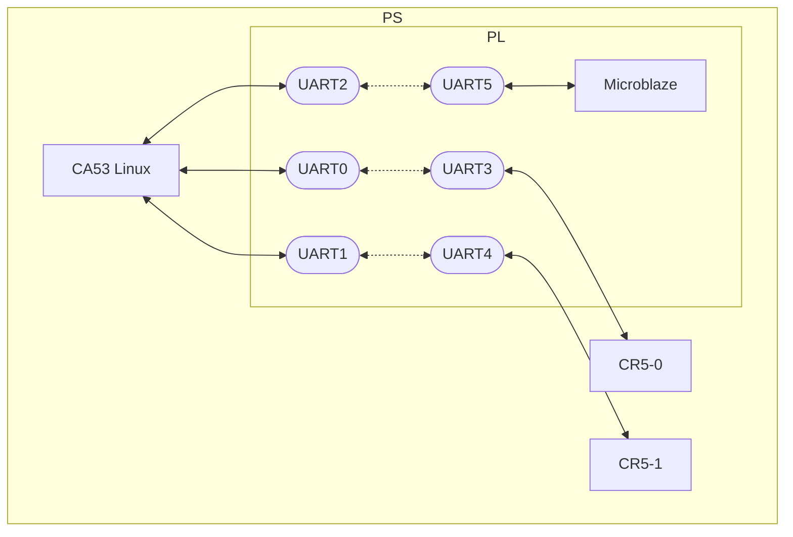

# UART-AMP for Kria(ZynqMP) 

[Click here for the English version](https://github.com/kern-gt/ZynqMP-UART-AMP-KR260-Ubuntu/blob/main/README.md)

## Overview
これは、ZynqMP上でLinuxとサブコアのコア間通信を行うデモです。以下の構成をサポートしています。
* CA53(AMD/Xilinx 認定Ubuntu22.04)
* サブコア(0,1) : PS上のCR5-0, CR5-1
* サブコア(2) : PL上のMicroblaze
* PL上でCA53(Linux)とサブコアをAXI-UARTLiteで接続
* エコーバックテストサンプル

CA53 : ARM Cortex-A53  
CR5 : ARM Cortex-R5
UART : Xilinx LogiCORE™ IP AXI UART Lite
  
## エコーバックテストを試す
ビルド済みのファームウェアとBitstreamを用意してあり、すぐにエコーバックテストを試すことができます。
詳しくは以下を参照してください。
[linux_uart_amp_echo_test/README_jp.md](https://github.com/kern-gt/ZynqMP-UART-AMP-KR260-Ubuntu/blob/main/linux_uart_amp_echo_test/README_jp.md)
  

## UART-AMPのメリット
* Linux側のUART APIが普通のシリアルのため、シンプルである
* Linux側のUARTドライバ(AXI-UARTLite)が成熟している
* サブコア側のAPIは送受信共にFreeRTOS Stream Bufferのため、シンプルである
* サブコア側のUARTドライバが成熟している
* AXI-UARTLite IPが成熟している
* CR5のSplitモードで2コアそれぞれで通信に対応できる
* Microblazeも複数コアに対応できる
* AXI-UARTLiteのIPはボーレートがコンパイル前に確定するため、ソフト側の通信速度設定ミスのバグが起きない
* デバッグ時はUARTのTX、RX線を外部に接続するようにBitsream変更すれば直接観測可
* UARTはマスタースレーブ方式と違い、送信側がタイミングを決定できる
* Devicetree OverlayコードはXSCTでVivadoエクスポートファイルから自動生成したものを使用できる

## UART-AMPのデメリット
* UARTのため、通信速度が遅い
* Clockジェネレータに不具合があるとボーレートずれで通信不良が起きるリスクがある
* AXI-UARTLiteのIPを配置するためのPLフットプリントコストが増加
* PLコンフィグレーションに失敗すると一切通信できない

   
## フォルダ構成
### hw_export
詳しくは以下を参照してください。  
[hw_export/README_jp.md](https://github.com/kern-gt/ZynqMP-UART-AMP-KR260-Ubuntu/blob/main/hw_export/README_jp.md)

### jtag_tcl
Kria K26 SOMはJtagboot用の切り替えスイッチが無いため、サブコアのJtagデバッグを行う際はXSCTからTCLコマンドで切り替える必要が有ります。
switch_jtagboot.shを実行すると切り替えることが出来ます。

### linux_uart_amp_echo_test
CA53(Linux側)で実行するための、エコーバックテストコードを格納してあります。詳しくは以下を参照してください。  
[linux_uart_amp_echo_test/README_jp.md](https://github.com/kern-gt/ZynqMP-UART-AMP-KR260-Ubuntu/blob/main/linux_uart_amp_echo_test/README_jp.md)

### microblaze_firmware.vitis_classic
サブコアのMicroblazeの開発環境のプロジェクトを格納してあります。
Vitis Classic v2024.1.1を使用しています。
Vitis Unified IDEでは、デバッグに不具合が出たため、MicroblazeのみClassic版を利用しています。  
[microblaze_firmware.vitis_classic/README_jp.md](https://github.com/kern-gt/ZynqMP-UART-AMP-KR260-Ubuntu/blob/main/microblaze_firmware.vitis_classic/README_jp.md)

### openamp_dts
CR5のファームウェアELFをロード、コアの起動・停止管理にremoteprocが必要です。そのために、ベースのDevicetreeを書き換える必要があります。
詳しくは以下を参照してください。  
[openamp_dts/README_jp.md](https://github.com/kern-gt/ZynqMP-UART-AMP-KR260-Ubuntu/blob/main/openamp_dts/README_jp.md)

### r5_firmware.vitis_unified_ide
サブコアのCR5の開発環境のプロジェクトを格納してあります。
Vitis Unified IDE v2024.1.1を使用しています。  
[r5_firmware.vitis_unified_ide/README_jp.md](https://github.com/kern-gt/ZynqMP-UART-AMP-KR260-Ubuntu/blob/main/r5_firmware.vitis_unified_ide/README_jp.md)

### vivado
IPインテグレータのTCLと制約ファイル(.xdc)を格納しています。
プロジェクト新規作成して、TCLを実行するとIPブロックが生成されます。
詳しくは以下を参照してください。  
[vivado/README_jp.md](https://github.com/kern-gt/ZynqMP-UART-AMP-KR260-Ubuntu/blob/main/vivado/README_jp.md)