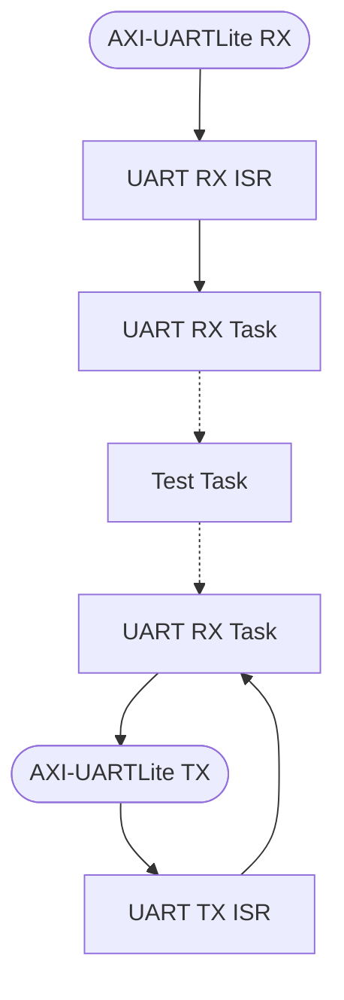

# Cortex-R5 firmware project for UART-AMP
[日本語版はこちら](https://github.com/kern-gt/ZynqMP-UART-AMP-KR260-Ubuntu/blob/main/r5_firmware.vitis_unified_ide/README_jp.md)
## Overview
This folder contains the Cortex-R5 (CR5) firmware project for Vitis Unified IDE v2024.1.1
This is the source code for the ELFs for CR5-0 and CR5-1 used in the echo-back test sample.

## How to use
This folder contains the following.
* Source code for the FreeRTOS-based loopback application part (app_src_r5_x/)
* Vitis Unified IDE export project zip

### Step 1: Import the project into Vitis
1. Set this folder (r5_firmware.vitis_classic) as workspace and start
1. Launch the import window from “File > import
1. Select _r5_firmware.zip_ for “import from Archive
1. Select all in “Components
1. “Finish”.

### Step 2: Importing the application source code
The _app_src_r5_0_ and _app_src_r5_1_ folders contain the loopback firmware code.
The source code with the same file name is also stored in the Vitis project, but the one in _app_src_r5_x_ is the latest one.
```
app_src_r5_0
├── app
│   ├── inc
│   │   ├── hardware_def.h
│   │   ├── led.h
│   │   ├── uart.h
│   │   └── user_def.h
│   ├── led.c
│   └── uart.c
├── lscript.ld
├── main.c
└── test
    ├── inc
    │   ├── reg_dump.h
    │   ├── uart_loopback_test.h
    │   ├── uart_recv_test.h
    │   └── uart_send_test.h
    ├── reg_dump.c
    ├── uart_loopback_test.c
    ├── uart_recv_test.c
    ├── uart_send_test.c
    └── uart_send_test_data.c

```
Overwrite under the following folders of the Vitis project.
```
app_src_r5_0/* => app_echo_uart_r5_0/src/
app_src_r5_1/* => app_echo_uart_r5_1/src/
```

Now you can build your code.
Also, you will need to switch to Jtagboot mode when you bag a single step execution of CR5.
We have prepared a shell script for Kria SOM that describes the TCL commands to switch to Jtag boot mode. 

[jtag_tcl/switch_jtagboot.sh](https://github.com/kern-gt/ZynqMP-UART-AMP-KR260-Ubuntu/tree/main/jtag_tcl)

The project is set up to run FSBL on CA53, so CR5 Jtag debug can be done immediately.

<br><br><br>

## Information for developers

### About Microblaze Firmware
Microblaze builds its projects in Vitis Classic IDE.
See the folder for Microblaze for more information
[microblaze_firmware.vitis_classic/](https://github.com/kern-gt/ZynqMP-UART-AMP-KR260-Ubuntu/tree/main/microblaze_firmware.vitis_classic)  

### Firmware Features
The following features are currently available
* Heartbeat LED
* 3 UART test apps selected at compile time

**UART test application features**  
* Loop back for echo back test (default)
* Transmit only test (test data defined in code)
* Receive-only test (test data is recorded in trace memory)

UART test app should be rebuilt by switching macros in main.c.

**Heartbeat LED**  
To check the operation of the sub-core side, drive LEDs on each of the CR5 and Microblaze cores.
For the KR260 board, the following assignments are used.
* CR5-0 : UF1_LED : F8 pin : LVCMOS18
* CR5-1 : UF2_LED : E8 pin : LVCMOS18
* CR5-0 : SFP_LED1(Browse Microblaze folder)

### Firmware Structure
The firmware is divided into the following elements
* Test task for loopback test or transmit test or receive test
* UART driver task
* Heartbeat LED task
* FreeRTOS

**Test task and UART driver task**  


The dotted arrow in the figure shows the _Stream Buffer_ of FreeRTOS.
By replacing the _Test Task_ part, users can develop their own applications.
The socket name of _Stream  Buffer_ is as follows.
* UART Receive : uart_recv_buf
* UART Send : uart_send_buf

The loopback testing task example uses the following
```
uint8_t uart_loopback_buf[REQ_RECV_DATA_BYTES];
for(;;)
    {
        get_bytes_cnt = xStreamBufferReceive(   uart_recv_buf,
                                                uart_loopback_buf,
                                                REQ_RECV_DATA_BYTES,
                                                20/ portTICK_PERIOD_MS);

        if(get_bytes_cnt > 0)
        {
            cnt = xStreamBufferSend(uart_send_buf,
                                    uart_loopback_buf,
                                    get_bytes_cnt,
                                    20/ portTICK_PERIOD_MS);

            if(cnt == 0){
                xil_printf( "buffer of uart_send_buf is full.\n" );
            }
        }
    }
```
<br><br>

### About Linker and Memory Map
To start CR5, a loader is required to place the executable ELFs into TCM (tightly coupled memory) and DRAM. This UART-AMP uses the Remoteproc Linux driver, which is responsible for OpenAMP ELF loading and core start/stop management.
The Remoteproc driver is pre-installed in Xilinx certified Ubuntu, but is not available by default because the device tree does not support it.
The following description is required in the device tree.
* Define shared memory with sub-cores as reserved area
* Definition of TCM
* Definition of CR5 core
* Whether LockStep or Split operation is available for CR5 core
* Definition of IPI (Inter-Core Interrupt) and mailbox

IPI and Mailbox will probably be unused, but will be defined just in case. Since OpenAMP is not yet supported on certified Ubuntu (2024/7), I gathered information from the web to create this. Naturally, there is no guarantee of operation.
The OpenAMP device tree is located at: CR5 Split (2-core mode)
[openamp_dts/zynqmp_openamp_r5_split.dtsi](https://github.com/kern-gt/ZynqMP-UART-AMP-KR260-Ubuntu/blob/main/openamp_dts/zynqmp_openamp_r5_split.dtsi)

**CR5 memory map**  
CR5 mainly arranges the following sections in DRAM.
* text
* bss
* resource_table

The device tree for OpenAMP designates this area as a reserved area with the following description.
* reserved-memory/rproc@3ed00000,size=0x40000 : CR5-0
* reserved-memory/rproc@3ef00000,size=0x40000 : CR5-1

The Linker scripts for each core of the CR5 project should also specify the same area. Doing this incorrectly may result in a crash.
* CR5-0 : psu_ddr_S_AXI_BASEADDR : ORIGIN = 0x3ED00000, LENGTH = 0x00040000
* CR5-1 : psu_ddr_S_AXI_BASEADDR : ORIGIN = 0x3EF00000, LENGTH = 0x00040000

The resource_table is a data definition specific to OpenAMP and is used for communication between OpenAMP cores called PRMsg. This section is empty because it is not needed in this case since the UART will take the place of RPMsg. However, when Remoteproc loads ELF, it parses this resource_table section and passes the information to RPMeg, so it is necessary to define a section.
Let's list the ELF sections as a test.
```
$ readelf -S app_echo_uart_r5_0.elf
There are 22 section headers, starting at offset 0x3211c:

Section Headers:
  [Nr] Name              Type            Addr     Off    Size   ES Flg Lk Inf Al
  [ 0]                   NULL            00000000 000000 000000 00      0   0  0
  [ 1] .vectors          PROGBITS        00000000 010000 000660 00  AX  0   0  8
  [ 2] .text             PROGBITS        3ed00000 020000 00ba34 00  AX  0   0 16
  [ 3] .init             PROGBITS        00000660 010660 00000c 00  AX  0   0  4
  [ 4] .fini             PROGBITS        0000066c 01066c 00000c 00  AX  0   0  4
  [ 5] .rodata           PROGBITS        00000678 010678 001bb9 00   A  0   0  8
  [ 6] .data             PROGBITS        00002238 012238 000480 00  WA  0   0  8
  [ 7] .drvcfg_sec       PROGBITS        000026b8 0126b8 000dc4 00  WA  0   0  4
  [ 8] .bootdata         PROGBITS        00003480 013480 000180 00  WA  0   0  8
  [ 9] .eh_frame         PROGBITS        00003600 013600 000004 00   A  0   0  4
  [10] .ARM.exidx        ARM_EXIDX       00003604 013604 000008 00  AL  2   0  4
  [11] .init_array       INIT_ARRAY      0000360c 01360c 000008 04  WA  0   0  4
  [12] .fini_array       FINI_ARRAY      00003614 013614 000004 04  WA  0   0  4
  [13] .ARM.attributes   ARM_ATTRIBUTES  00003618 02ba34 00002f 00      0   0  1
  [14] .bss              NOBITS          3ed20100 030100 0191f0 00  WA  0   0  8
  [15] .heap             NOBITS          00003618 013618 001408 00  WA  0   0  1
  [16] .stack            NOBITS          00020000 020000 003800 00  WA  0   0  1
  [17] .resource_table   PROGBITS        3ed20000 02ba63 000000 00   W  0   0  1
  [18] .comment          PROGBITS        00000000 02ba63 000012 01  MS  0   0  1
  [19] .symtab           SYMTAB          00000000 02ba78 003890 10     20 476  4
  [20] .strtab           STRTAB          00000000 02f308 002d50 00      0   0  1
  [21] .shstrtab         STRTAB          00000000 032058 0000c2 00      0   0  1
Key to Flags:
  W (write), A (alloc), X (execute), M (merge), S (strings), I (info),
  L (link order), O (extra OS processing required), G (group), T (TLS),
  C (compressed), x (unknown), o (OS specific), E (exclude),
  D (mbind), y (purecode), p (processor specific)
```

The resource_table section has physical address = 0x3ed20000 and area size 0.

