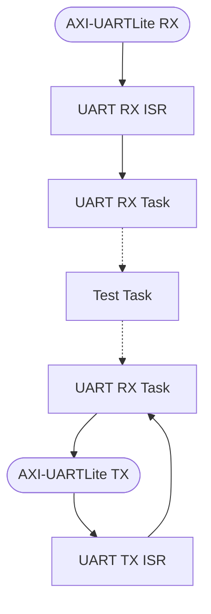

# UART-AMP向けCortex-R5ファームウェアプロジェクト
[Click here for the English version](https://github.com/kern-gt/ZynqMP-UART-AMP-KR260-Ubuntu/blob/main/r5_firmware.vitis_unified_ide/README.md)
## 概要
このフォルダにはVitis Unified IDE v2024.1.1用のCortex-R5(CR5)ファームウェアプロジェクトが格納されています.
エコーバックテストのサンプルで使用するCR5-0、CR5-1用のELFの元となるソースコードになります.

## 使用方法
このフォルダには以下のものが含まれています.
* FreeRTOSベースのループバックアプリ部分のソースコード(app_src_r5_x)
* Vitis Unified IDEのエクスポートプロジェクトZIP

### 手順１：Vitisにプロジェクトをインポート
1. このフォルダ(r5_firmware.vitis_classic)をワークスペースに設定して起動
1. "File > import"からインポートウィンドウを起動
1. "import from Archive"に _r5_firmware.zip_ を選択
1. "Components"に全てを選択
1. "Finish"

### 手順２：アプリケーションソースコードの取り込み
_app_src_r5_0/_ 、 _app_src_r5_1/_ フォルダにループバックファームウェアのコードが格納されています.
Vitisプロジェクト内にも同じファイル名のソースコードが格納されていますが、 _app_src_r5_x/_ のものが最新のものとなります.
```
app_src_r5_0
├── app
│   ├── inc
│   │   ├── hardware_def.h
│   │   ├── led.h
│   │   ├── uart.h
│   │   └── user_def.h
│   ├── led.c
│   └── uart.c
├── lscript.ld
├── main.c
└── test
    ├── inc
    │   ├── reg_dump.h
    │   ├── uart_loopback_test.h
    │   ├── uart_recv_test.h
    │   └── uart_send_test.h
    ├── reg_dump.c
    ├── uart_loopback_test.c
    ├── uart_recv_test.c
    ├── uart_send_test.c
    └── uart_send_test_data.c

```
Vitisプロジェクトの以下のフォルダ以下に上書きします.
```
app_src_r5_0/* => app_echo_uart_r5_0/src/
app_src_r5_1/* => app_echo_uart_r5_1/src/
```
以上で、コードのビルドが出来るようになります.
また、CR5の単体ステップ実行でバッグをする際にJtagbootモードへの移行が必要になります.Kria SOM向けにJtag bootモードに移行できるTCLコマンドを記述したShellスクリプトを用意してあります.  

[jtag_tcl/switch_jtagboot.sh](https://github.com/kern-gt/ZynqMP-UART-AMP-KR260-Ubuntu/tree/main/jtag_tcl)

プロジェクトではCA53でFSBLを実行するように設定していますので、CR5のJtagデバッグはすぐ行うことが出来ます.

<br><br><br>

## 開発者向け情報

### Microblazeのファームウェアについて
MicroblazeはVitis Classic IDEでプロジェクトを構築しています.
詳細はMicroblaze用フォルダを参照してください
[microblaze_firmware.vitis_classic/](https://github.com/kern-gt/ZynqMP-UART-AMP-KR260-Ubuntu/tree/main/microblaze_firmware.vitis_classic)  
  
### ファームウェアの機能
現在以下の機能があります.
* ハートビートLED
* 3つのUARTテストアプリをコンパイル時に選択

**UARTテストアプリの機能**  
* エコーバックテスト用のループバック(デフォルト)
* 送信のみテスト(テストデータはコード内定義)
* 受信のみテスト(トレースメモリに記録)

UARTテストアプリはmain.cでマクロを切り替えてリビルドしてください.

**ハートビートLED**  
サブコア側の動作確認をするため、CR5とMicroblazeのそれぞれのコアでLEDを駆動します.
KR260ボードの場合は以下の割当てにしています.
* CR5-0 : UF1_LED : F8端子 : LVCMOS18
* CR5-1 : UF2_LED : E8端子 : LVCMOS18
* CR5-0 : SFP_LED1

### ファームウェアの構造
ファームウェアは以下の要素に分けられています.
* ループバックテストor送信テストor受信テストのテストタスク
* UARTドライバタスク
* ハートビートLEDタスク
* FreeRTOS

**テストタスクとUARTドライバタスク**  

図の点線矢印の部分はFreeRTOSの _Stream Buffer_ を使用しています.
_Test Task_ の部分を置き換えることで、ユーザ独自のアプリケーションを開発できるようになります.
_Stream Buffer_ のソケット名は以下としています.
* UART 受信 : uart_recv_buf
* UART 送信 : uart_send_buf

ループバックテスト用タスクの例では以下のように使用しています.
```
uint8_t uart_loopback_buf[REQ_RECV_DATA_BYTES];
for(;;)
    {
        get_bytes_cnt = xStreamBufferReceive(   uart_recv_buf,
                                                uart_loopback_buf,
                                                REQ_RECV_DATA_BYTES,
                                                20/ portTICK_PERIOD_MS);

        if(get_bytes_cnt > 0)
        {
            cnt = xStreamBufferSend(uart_send_buf,
                                    uart_loopback_buf,
                                    get_bytes_cnt,
                                    20/ portTICK_PERIOD_MS);

            if(cnt == 0){
                xil_printf( "buffer of uart_send_buf is full.\n" );
            }
        }
    }
```
<br><br>

### Linkerとメモリマップについて
CR5を起動するには実行ファイルのELFをTCM(密結合メモリ)とDRAMに配置するローダが必要になります.このUART-AMPではOpenAMPのELFロード及びコアの起動・停止管理を担う、Remoteproc Linuxドライバを使用します.
RemoteprocドライバはXilinx認定Ubuntuには予め含まれていますが、デバイスツリーが対応していないため、デフォルトで使用できません.
デバイスツリーには以下の記述が必要です.
* サブコアとの共有メモリを予約領域として定義
* TCMの定義
* CR5コアの定義
* CR5コアのLockStep or Split動作の可否
* IPI(コア間割込み)とmailboxの定義

IPIとMailboxについてはおそらく未使用になりますが、一応定義します.認定UbuntuでOpenAMPのサポートがまだないので(2024/7)、Webの情報を集めて作成しました.当然動作保証はありません.
OpenAMPのデバイスツリーは以下の場所にあります.  
CR5のSplit(2コアモード)
[openamp_dts/zynqmp_openamp_r5_split.dtsi](https://github.com/kern-gt/ZynqMP-UART-AMP-KR260-Ubuntu/blob/main/openamp_dts/zynqmp_openamp_r5_split.dtsi)

**CR5のメモリマップ**  
CR5は主に次のセクションをDRAMに配置しています.
* text
* bss
* resource_table

OpenAMP用のデバイスツリーではこの領域を次の記述で予約領域としています.
* reserved-memory/rproc@3ed00000,size=0x40000 : CR5-0
* reserved-memory/rproc@3ef00000,size=0x40000 : CR5-1

CR5プロジェクトの各コアのLinkerスクリプトも同じ領域を指定するようにします.これを間違うとクラッシュする可能性があります.
* CR5-0 : psu_ddr_S_AXI_BASEADDR : ORIGIN = 0x3ED00000, LENGTH = 0x00040000
* CR5-1 : psu_ddr_S_AXI_BASEADDR : ORIGIN = 0x3EF00000, LENGTH = 0x00040000

resource_tableとはOpenAMP固有のデータ定義でPRMsgと呼ばれるOpenAMPのコア間通信に用いられます.今回UARTでRPMsgの代わりを行うため必要ないので空ですが、RemoteprocがELFをロードする際、このresource_tableセクションを解析してRPMegに情報を渡す役割をするので、セクションを定義する必要があります.
試しにELFのセクションの一覧を表示してみます.
```
$ readelf -S app_echo_uart_r5_0.elf
There are 22 section headers, starting at offset 0x3211c:

Section Headers:
  [Nr] Name              Type            Addr     Off    Size   ES Flg Lk Inf Al
  [ 0]                   NULL            00000000 000000 000000 00      0   0  0
  [ 1] .vectors          PROGBITS        00000000 010000 000660 00  AX  0   0  8
  [ 2] .text             PROGBITS        3ed00000 020000 00ba34 00  AX  0   0 16
  [ 3] .init             PROGBITS        00000660 010660 00000c 00  AX  0   0  4
  [ 4] .fini             PROGBITS        0000066c 01066c 00000c 00  AX  0   0  4
  [ 5] .rodata           PROGBITS        00000678 010678 001bb9 00   A  0   0  8
  [ 6] .data             PROGBITS        00002238 012238 000480 00  WA  0   0  8
  [ 7] .drvcfg_sec       PROGBITS        000026b8 0126b8 000dc4 00  WA  0   0  4
  [ 8] .bootdata         PROGBITS        00003480 013480 000180 00  WA  0   0  8
  [ 9] .eh_frame         PROGBITS        00003600 013600 000004 00   A  0   0  4
  [10] .ARM.exidx        ARM_EXIDX       00003604 013604 000008 00  AL  2   0  4
  [11] .init_array       INIT_ARRAY      0000360c 01360c 000008 04  WA  0   0  4
  [12] .fini_array       FINI_ARRAY      00003614 013614 000004 04  WA  0   0  4
  [13] .ARM.attributes   ARM_ATTRIBUTES  00003618 02ba34 00002f 00      0   0  1
  [14] .bss              NOBITS          3ed20100 030100 0191f0 00  WA  0   0  8
  [15] .heap             NOBITS          00003618 013618 001408 00  WA  0   0  1
  [16] .stack            NOBITS          00020000 020000 003800 00  WA  0   0  1
  [17] .resource_table   PROGBITS        3ed20000 02ba63 000000 00   W  0   0  1
  [18] .comment          PROGBITS        00000000 02ba63 000012 01  MS  0   0  1
  [19] .symtab           SYMTAB          00000000 02ba78 003890 10     20 476  4
  [20] .strtab           STRTAB          00000000 02f308 002d50 00      0   0  1
  [21] .shstrtab         STRTAB          00000000 032058 0000c2 00      0   0  1
Key to Flags:
  W (write), A (alloc), X (execute), M (merge), S (strings), I (info),
  L (link order), O (extra OS processing required), G (group), T (TLS),
  C (compressed), x (unknown), o (OS specific), E (exclude),
  D (mbind), y (purecode), p (processor specific)
```

resource_tableセクションが物理アドレス=0x3ed20000で領域サイズ0になっています.
